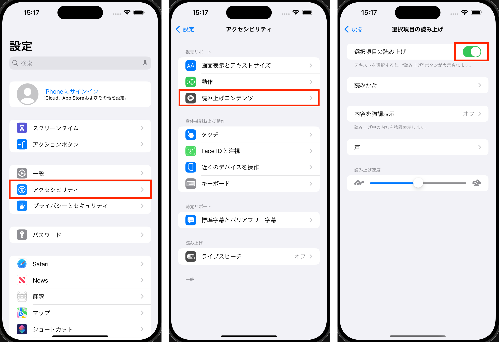
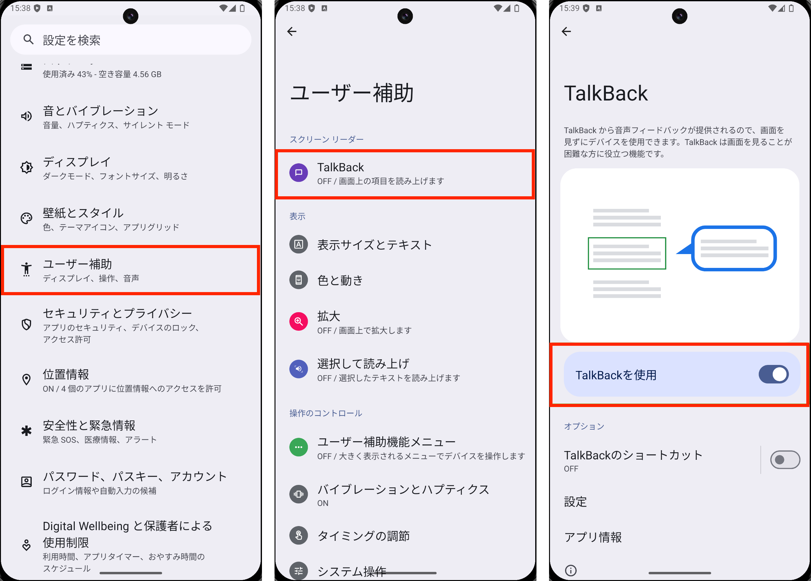

# 耳を使ったインプットのすすめ

<!-- 皆さん、お疲れ様です。 発表者のドンです。 -->
<!-- 発表するタイトルは耳を使ったインプットのすすめです。 -->
<!-- 今回話す内容は技術同人誌で一部取り扱っている内容を抜粋してスライド形式にしたものとなります。 -->

---

## 目次

- Page 1
- Page 2
- Page 3
- Page 4
- Page 5

<!-- 目次はこんな感じです。 -->
<!-- 10分以内に収めるようにします。 -->

---

## はじめに

耳を使ったインプットのすすめというテーマの中でも、特に**目を使わずに電子書籍を聞く方法**について

<!-- はじめに、今回のテーマの「耳を使ったインプットのすすめ」で扱う題材ですが、いろいろと特に、目を使わずに積読を解消する方法について説明します。 -->

---

## きっかけは緑内障の診断結果

眼科でコンタクトレンズ着用の検査のついてに緑内障が見つかる

↓

目を使って「見る」という体験に制限がかかる

↓

目を使わないでできる体験をする

<!-- まずは、私が緑内障と診断された話から始めます。医師から目を休ませることの重要性を強調され、目の使い過ぎによる疲労が問題となりました。 -->

---

## 読書の時間と目の疲れ

-

<!-- 以前は毎日読書の時間を設けていました。しかし、目の疲れが原因で長時間の読書が難しくなりました。目を酷使しない方法を探し始めたのです。 -->

---

## スマホの読み上げ機能

そこで出会ったのがスマホの読み上げ機能です。これは目を使わずにコンテンツを読み上げてくれる優れたツールです。使い始めると、その便利さに驚きました。

---

### iOS の場合

---

### Android の場合

---

## Kindle と読み上げ機能の組み合わせ

さらに、Kindle の電子書籍とスマホの読み上げ機能を組み合わせることで、効率的なインプットが可能になりました。これにより、目の負担を軽減しながら多くの情報を得ることができるようになりました。

---

## 実際の活用方法

具体的には、Kindle で購入した本をスマホにダウンロードし、読み上げ機能を使って内容を聴く方法です。これにより、移動中や休憩時間など、目を使わない時間にインプットを続けることができます。

---

## メリットと注意点

この方法のメリットは、目の疲れを軽減できる点と、時間を有効活用できる点です。しかし、音声の速さや声の質によっては集中力が続かないこともありますので、自分に合った設定を見つけることが大切です。

---

## まとめ

目を使わないインプット方法として、スマホの読み上げ機能と Kindle の組み合わせは非常に有効です。目の健康を守りながら知識を増やすために、皆さんもぜひ試してみてください。

---

## ご清聴ありがとうございました

Powered by Marp、Chat-GPT
