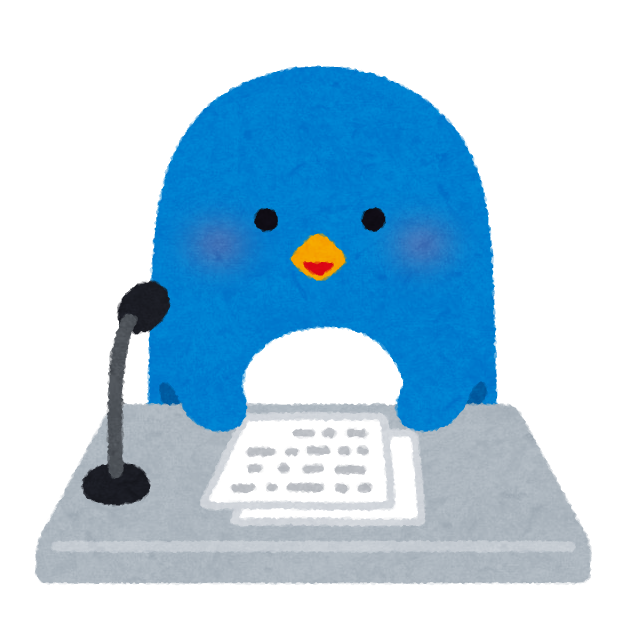
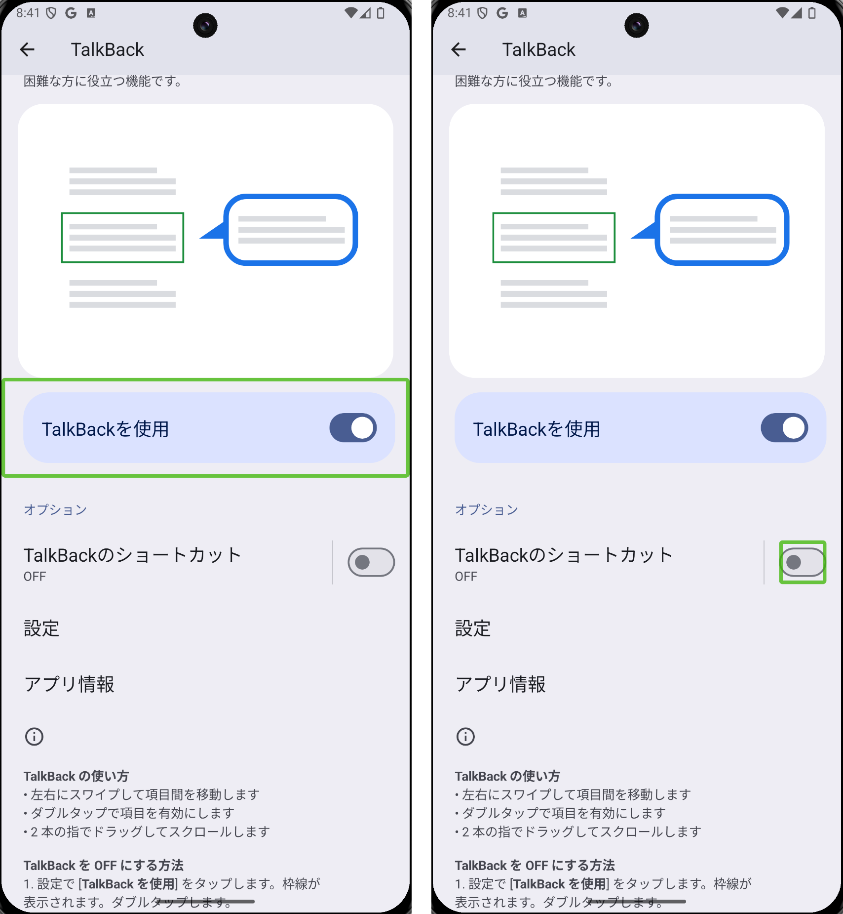
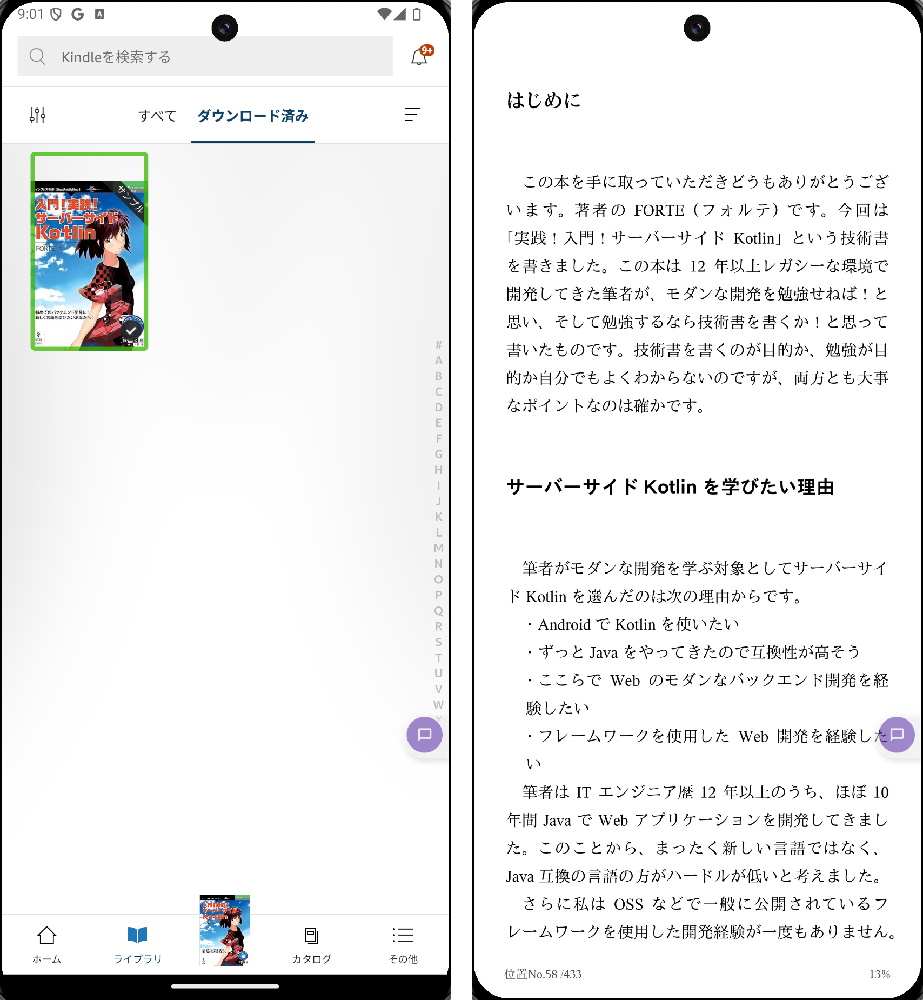
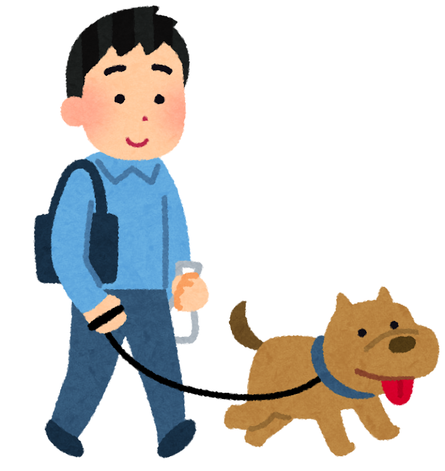

# 耳を使ったインプットのすすめ

<!-- 皆さん、お疲れ様です。 発表者のドンです。 -->
<!-- 発表するタイトルは耳を使ったインプットのすすめです。 -->
<!-- 今回話す内容は技術同人誌で一部取り扱っている内容を抜粋してスライド形式にしたものとなります。 -->

---

## 目次

- はじめに
- きっかけは緑内障の診断結果
- インプットの時間と目の疲れ
- スマホの読み上げ機能
- Kindle と読み上げ機能の組み合わせ
- メリット、注意点
- まとめ

<!-- 目次はこんな感じです。 -->
<!-- 10分以内に収めるようにします。 -->

---

## はじめに

耳を使ったインプットのすすめというテーマの中でも、特に**目を使わずに電子書籍を聞く方法**について

<!-- はじめに、今回のテーマの「耳を使ったインプットのすすめ」で扱う題材ですが、特に、目を使わずに積読になりがちな電子書籍を解消する方法とについて話します。 -->

---

## きっかけは緑内障の診断結果

眼科での検査で緑内障が見つかる 🏥

<!-- まず、そもそも自分が耳を使ったインプットをしようとしたきっかけについてちょっと話をします。 -->
<!-- 皆さんご存知だと思いますが、自分は5月に緑内障だと診断された -->
<!-- 知らない人がいたら、そうなんだと思ってください -->
<!-- コンタクトレンズの着用のことで検査を受けに行ったら、緑内障検査も受けて、その結果目がちょっと不自由になることがわかりました。 -->
<!-- それで、眼科の先生からは目の使い過ぎによる疲れを注意されたり、こまめに目を休ませるようすすめられたりしました -->
<!-- 日常では仕事で目を使う時間が長いとか外出しても紫外線の影響を受けるとかで、目を使った体験とか活動に制約がかかってしまうのがちょっと困るポイントとなりました -->
<!-- そこで、目を使う体験も大事だと思いつつ、目を使わずにできることにはどんなことがあるのかについて興味を持つようになりました。 -->
<!-- それで、最終的には目を使わないでできる体験にも興味を持つようになりました。 -->

---

## きっかけは緑内障の診断結果

---

## きっかけは緑内障の診断結果

「見る」という体験に制限がかかる 🤔

---

## きっかけは緑内障の診断結果

目を使わないでできる体験をする 💡

---

## インプットの時間と目の疲れ

インプットに制約がかかるのあは困る 🥺

↓

なんだかんだブログを見たり、kindle unlimited を使ったりする 📖

↓

コンテンツを「聴く」ことで見る体験の代わりになるのではないか？ 🤔

<!-- 目を使う体験の中でできなくなると何が一番困るかというと、情報のインプットでした -->
<!-- インプットといえば、ブログを見たり、本を見たりするのが多いかなと思いますが、そこらへんができなくなるのがきついかなと思いましたね -->
<!-- 今までは通勤時間だったり、始業前の時間でなにかしら見る時間を設けていましたので、個人的にどうにかしたいところでした -->
<!-- そこで普段使っているデバイスでなにか方法は内かなと調べたところ、コンテンツを聞く方法でどうにかなるのではないかと思った次第です -->

---

## スマホの読み上げ機能

補助的な UI を表示、**音声で案内するフィードバック**を提供する機能

<!-- そこで初めて知ったのがスマホの読み上げ機能でした。 -->
<!-- どんな機能か簡単に言うと、ユーザー補助機能の一つでして、目が不自由な人だったり、視力が弱い人に対して補助的なUIを表示したり、音声で案内するフィードバックを提供するものです -->
<!-- とくに自分にとっては目を使わず、音声でコンテンツを読み上げてくれるツールとして使えそうだなと感じました -->
<!-- そして、実際に使ってみたらコンテンツを読み上げてくれるので目を使わず、耳だけでコンテンツのインプットができるようになりました。 -->

---

### iOS の場合

<!-- 簡単な説明ですが、iOSの場合は設定の読み上げコンテンツの選択項目の読み上げをOnにすることで使えるようになります -->

---

### Android の場合

<!-- Androidの場合は設定のユーザー補助のTalkBackという機能をOnにすることで使えるようになります -->

---

## Kindle と読み上げ機能の組み合わせ

<!-- さらに、Kindle の電子書籍とスマホの読み上げ機能を組み合わせることで、効率的なインプットが可能になりました。これにより、目の負担を軽減しながら多くの情報を得ることができるようになりました。 -->

---

## 実演

Android で kindle の読み上げ

---

## 実際するシーン

- 朝の散歩中に聞く
- 通勤中に聞く

<!-- 具体的には、Kindle で購入した本をスマホにダウンロードし、読み上げ機能を使って内容を聴く方法です。これにより、移動中や休憩時間など、目を使わない時間にインプットを続けることができます。 -->

---

## メリット

積読が解消される

常に画面を見なくていいので目に優しい

<!-- この方法のメリットは、目の疲れを軽減できる点と、時間を有効活用できる点です。しかし、音声の速さや声の質によっては集中力が続かないこともありますので、自分に合った設定を見つけることが大切です。 -->
<!--   - 体感的に1日通勤で1冊（200ページ）は読破 -->

---

## 注意点

TalkBackをOnにするとスマホの他の機能に触れない

スクリーンをつけたままにする必要がある

<!-- この方法のメリットは、目の疲れを軽減できる点と、時間を有効活用できる点です。しかし、音声の速さや声の質によっては集中力が続かないこともありますので、自分に合った設定を見つけることが大切です。 -->

---

## まとめ

目を使わないインプット方法として、スマホの読み上げ機能と Kindle の組み合わせは非常に有効です。目の健康を守りながら知識を増やすために、皆さんもぜひ試してみてください。

---

## ご清聴ありがとうございました

Powered by Marp、Chat-GPT
